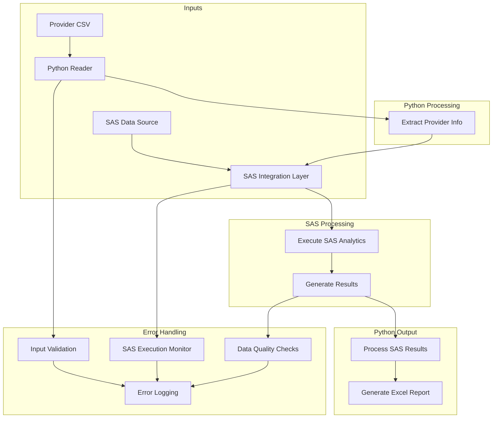

# SAS-Python Integration Pipeline Documentation

## Overview
This project implements a production data pipeline using Jupyter Notebooks to orchestrate interactions between Python and SAS for payment provider analytics. The pipeline processes provider data through SAS analytics procedures and generates Excel reports using Python.

## System Requirements

### Software Dependencies
1. Jupyter Notebook environment
2. Python 3.x
   - pandas (for CSV and Excel operations)
   - saspy (for SAS integration)
3. SAS installation with appropriate licenses
4. Configuration for SAS-Python integration

### Input Requirements
1. CSV file containing:
   - Payment provider identification
   - Data source location/path
   - Provider-specific parameters
2. SAS data sources as specified in the CSV
3. Proper read/write permissions for all file locations

### Output Requirements
1. Excel file containing processed analytics results
2. Proper error handling and logging
3. Execution audit trail

## Security Considerations
1. Secure handling of provider data
2. Access control for input/output locations
3. Credential management for SAS integration
4. Audit logging of all data access

## Error Handling Requirements
1. Validation of CSV input format
2. SAS procedure execution status checking
3. Data quality checks at each stage
4. Proper exception handling and reporting
5. Recovery procedures for failed executions

## Performance Requirements
1. Efficient handling of large datasets
2. Resource monitoring during SAS procedures
3. Optimization of data transfers between Python and SAS
4. Memory management for Excel file generation

## Maintenance Requirements
1. Documentation of all dependencies
2. Version control for notebooks
3. Testing procedures
4. Backup and recovery procedures

